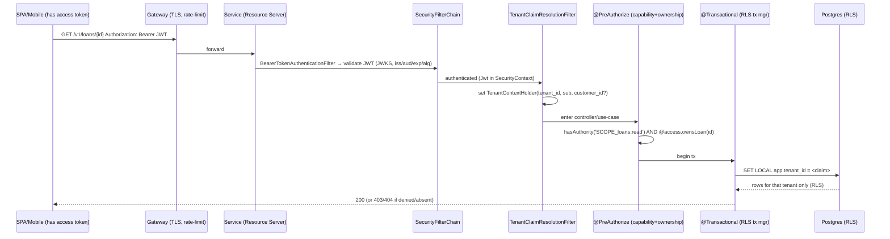
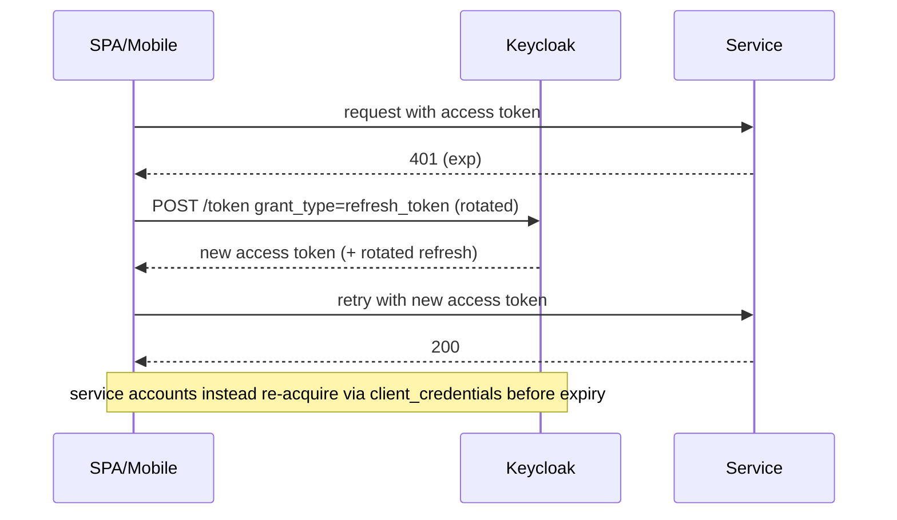

# Originex — Authentication & Authorization Design

**Status:** proposal (no code yet), revised after security review. Companion to
`dev/RLS_DESIGN.md` and `dev/RLS_ENABLEMENT.md`. This document designs the
perimeter and identity layer that makes row-level security *meaningful*: RLS
isolates tenants at the database, but only if the tenant context is derived from
an **authenticated, authorized** principal rather than a self-asserted header.

**Revision note:** this version resolves review finding **F1** (user/principal
model + intra-tenant authorization) and incorporates **F2–F16**. A
finding-by-finding disposition is in §17.

Grounded in the repository at HEAD `0874cd9`:
- No Spring Security is present in any module.
- `TenantResolutionFilter` (shared starter, order `HIGHEST_PRECEDENCE+10`) trusts
  the `X-Tenant-Id` header unconditionally and sets `TenantContextHolder`.
- `TenantContext` carries `{tenantId, tenantSlug, tier}` — **no user/principal**.
- Internal service-to-service calls are synchronous REST (`RestClient`) that
  forward `X-Tenant-Id` with **no** caller authentication (e.g.
  `los-service/.../CustomerServiceAdapter`).
- Kafka `tenant_id` headers are set by `OutboxPoller` from the **persisted**
  outbox row and consumed via `TenantRecordInterceptor` (trustworthy provenance).
- RLS enforcement is fully built but gated off (`originex.rls.enabled=false`).

---

## 1. Current security posture and gaps

| Area | Today | Gap |
|---|---|---|
| Authentication (inbound) | none | Any client reaches any endpoint unauthenticated |
| Tenant establishment | `X-Tenant-Id`, trusted | **Tenant impersonation** — read any tenant by setting the header |
| Authorization (capability) | none | No RBAC; any caller can invoke any operation |
| Authorization (intra-tenant) | none | Even with tenant isolation, no notion of *which subject* may act on *which record* |
| Service-to-service | REST forwarding `X-Tenant-Id`, no creds | A reachable service can call any other as any tenant |
| Kafka provenance | `tenant_id` from persisted outbox row | Trustworthy **iff** the write was authenticated **and** the topic is producer-ACL protected |
| RLS | built, disabled | Depth control with **no perimeter**; isolates at *tenant* granularity only |
| Auditability | `tenantId` in MDC only | No authenticated principal in logs/audit trail |

**Two distinct isolation guarantees.** Tenant-level isolation (RLS) is *necessary
but not sufficient*. A complete model needs three layers (§4.2): tenant isolation,
capability authorization, and — for principals that must see only their own
records — **subject/ownership** authorization. The original design covered the
first two; this revision adds the third (F1).

---

## 2. Threat model

Assets: tenant PII (KYC, Aadhaar/PAN), loan/payment records, GL postings — a
regulated (RBI) Indian lending platform. Multi-tenant (co-lending / BaaS).

| # | Threat | Today | After this design |
|---|---|---|---|
| T1 | Cross-tenant read via header spoofing | Trivial | Tenant from signed JWT claim; header ignored |
| T2 | Unauthenticated access to any endpoint | Open | Resource server rejects missing/invalid tokens (401) |
| T3 | Privilege escalation (capability) | No roles | RBAC via scopes/roles + method security, deny-by-default |
| T4 | Lateral movement between services | Any→any, any tenant | S2S tokens (private_key_jwt/mTLS), per-service scopes |
| T5 | Token forgery/tampering | n/a | RS256 + `iss`/`aud`/`exp` + JWKS; alg allowlist |
| T6 | Token replay/theft | n/a | Short TTL, TLS-only, audience binding; DPoP/mTLS (roadmap) |
| T7 | Kafka event tenant forgery | Header from DB row | Provenance preserved **+ broker producer ACLs** (§6) |
| T8 | Key compromise/rotation failure | n/a | JWKS rotation, short cache TTL, multi-`kid` |
| T9 | Repudiation (who did what) | Only tenant in logs | Authenticated `sub`/`act`/`client_id` in audit |
| **T10** | **Intra-tenant subject leak** (a borrower sees a co-tenant borrower's PII) | **Open** | **Ownership layer: subject-scoped principals (§4.2/§4.3)** |
| **T11** | **IdP compromise** (self-hosted Keycloak RCE/misconfig) | n/a | **IdP hardening runbook + threat model + patch SLA (§11, §14)** |
| **T12** | **Dual-mode downgrade** (omit token → header-trust bypass during PERMISSIVE) | n/a | **Time-boxed, network-restricted, monitored (§8)** |
| **T13** | **Rollback regression** (drop auth while RLS on → RLS serves spoofed tenant) | n/a | **Coupled kill-switch: RLS off is a precondition (§12)** |

Out of scope (infra/platform): TLS termination, WAF, DDoS, secret-store backend.
Broker transport auth and topic ACLs (T7) are infra-owned but are a **required
precondition** here, not optional.

---

## 3. Authentication architecture

### 3.1 Shape: per-service OAuth2 Resource Server (Spring Security 6)

Each service is a **stateless OAuth2 Resource Server** validating a bearer JWT on
every request. Per-service (not gateway-only) so an internal caller cannot bypass
the edge — defense in depth, and it fits the existing per-service starter model
(ships uniformly and dark, like RLS). A gateway (§7) adds TLS/routing/rate-limit
but is **not** the sole trust boundary.

### 3.2 Wiring (shared starter, gated) — with concrete filter ordering (F2)

New `SecurityAutoConfiguration` in `libs/spring-boot-starter`, gated by
`originex.security.enabled` (default `false`), contributing a `SecurityFilterChain`
(stateless, CSRF off, actuator rules per §11), a JWKS-backed `JwtDecoder`, a
`JwtAuthenticationConverter` (§4.5), and `@EnableMethodSecurity`.

**Filter ordering (load-bearing).** Today `TenantResolutionFilter` is registered
via `FilterRegistrationBean` at `HIGHEST_PRECEDENCE+10` (≈ `Integer.MIN_VALUE`),
which runs **before** Spring Security's `FilterChainProxy` (default order `-100`).
If left as-is, tenant would be derived *before* authentication. The fix is
explicit and mandatory:

- **Retire** the standalone `FilterRegistrationBean` for tenant resolution when
  `originex.security.enabled=true`.
- **Add tenant resolution *inside* the security chain**, immediately **after**
  `BearerTokenAuthenticationFilter`, via
  `http.addFilterAfter(new TenantClaimResolutionFilter(...), BearerTokenAuthenticationFilter.class)`.
  It reads the authenticated `Jwt` from the `SecurityContext`, extracts the
  tenant/subject claims (§5), and sets `TenantContextHolder` + MDC. Because it runs
  post-authentication and pre-controller, the `@Transactional` boundary (and
  `SET LOCAL app.tenant_id`) still opens after the tenant is set.
- When `originex.security.enabled=false`, the legacy header filter remains exactly
  as today (no behavior change).

An integration test asserts the effective filter order (auth filter precedes
tenant resolution). See the updated REST sequence in §15.1.

### 3.3 JWT validation (F5/F12 hardened)

- **Algorithm allowlist:** RS256 only. Reject `none` and all HS\* (the classic
  RS256→HS256 confusion); with `NimbusJwtDecoder` + JWKS this is already precluded
  (asymmetric keys only), but the allowlist is set explicitly. Validate
  `typ = at+jwt` (RFC 9068) where the IdP emits it.
- **Key discovery:** OIDC `issuer-uri` → `jwks_uri`; keys cached (short TTL), multi-`kid`.
- **Validators:** signature; `exp`/`nbf` with bounded skew (30s); `iss` exact;
  **`aud` must include the service's audience** (§4.4, F8); tenant/subject claim
  well-formedness (UUID). Missing/invalid → 401.
- **Offline:** no per-request IdP call → no hot-path latency/availability coupling.

### 3.4 End-user login flow and browser concerns (F11)

- **Interactive login:** OAuth2 **Authorization Code + PKCE** (SPAs and mobile;
  public clients, no client secret). Handled by the IdP + front-end; services only
  ever see the resulting access token.
- **Refresh:** short access tokens (5–15 min) refreshed via the IdP token endpoint
  (§15.4); refresh tokens rotated, stored per platform guidance (in-memory / secure
  storage, never `localStorage` for high-value tokens).
- **CORS:** an explicit origin allowlist at the gateway/resource server; tokens are
  sent as `Authorization` bearer (not cookies), so CSRF is not applicable.

### 3.5 OIDC provider

Compared in §14. Recommendation: **self-hosted Keycloak** (with the hardening
ownership called out in §11/§14, F10).

---

## 4. Authorization model

### 4.1 User & principal model (F1)

Originex v1 is a **B2B2C** platform. A **tenant** is a lending entity (bank / NBFC
/ co-lending partner), identified by `tenant_id` (UUID, the same value RLS uses).
There are three principal *kinds*, each represented by a distinct token shape:

| Kind | Auth flow | Key claims | Scoping |
|---|---|---|---|
| **Human — staff** (tenant or platform) | Auth Code + PKCE | `sub`, `tenant_id`, `roles`, `scope` | Tenant-scoped (staff of that tenant); platform staff are cross-tenant via system route (§4.3, F3) |
| **Human — customer** (borrower) | Auth Code + PKCE | `sub`, `tenant_id`, **`customer_id`**, `role=CUSTOMER`, `scope` (own-only) | Tenant-scoped **and** subject-scoped to `customer_id` |
| **Machine — service account** | client_credentials via **private_key_jwt / mTLS** (F4) | `client_id`/`azp`, `scope`; `tenant_id` only when acting for a tenant (token exchange) | Least-privilege per service; tenant via delegation |

Multi-tenant humans (e.g. a group auditor, a partner ops user covering several
tenants) hold **multiple** tenant memberships in the IdP; the token carries a
**single active `tenant_id`** chosen at login/tenant-switch (a new token is minted
per active tenant). A principal never holds two active tenants in one token — this
keeps the RLS binding unambiguous (§5.2).

### 4.2 Three authorization layers

Every tenant-scoped operation is gated by three independent checks; **all must
pass** (deny-by-default, F8):

1. **Tenant isolation** — `tenant_id` claim → `TenantContextHolder` →
   `SET LOCAL app.tenant_id` → RLS. Automatic, DB-enforced. Stops cross-tenant.
2. **Capability (RBAC)** — role→scopes mapped to Spring authorities, enforced by
   `@PreAuthorize` on the use-case ports (§4.5). Stops "wrong operation."
3. **Ownership (subject scope)** — for `CUSTOMER` principals (and any future
   subject-scoped role), the operation must target the caller's own records:
   `resource.customerId == authentication.customerId`. Stops "right tenant, wrong
   subject" (T10).

**Where each is enforced.**
- Layer 1: transaction manager + RLS (already built).
- Layer 2: method security at the application-service boundary (hexagonal ports)
  — a single choke point per operation.
- Layer 3: **primary** enforcement in the use-case via an `AccessPolicy` bean
  invoked from `@PreAuthorize` (belt); **optional defense-in-depth** via a second
  RLS predicate keyed on a `app.customer_id` GUC set only for CUSTOMER principals
  (suspenders) — an additive, backward-compatible policy on customer-facing tables
  (`... AND (current_setting('app.subject_scope', true) IS NULL OR customer_id =
  current_setting('app.customer_id', true)::uuid)`). The GUC is set by the same
  resolver that sets `app.tenant_id`. This is optional and can land after v1; the
  application-layer check is mandatory for v1.

### 4.3 Actor catalog

| Actor | Kind | Representation | Notes |
|---|---|---|---|
| **Customer (borrower)** | Human, subject-scoped | `role=CUSTOMER`, `customer_id` claim | Own records only (Layer 3) |
| **Partner** (external system) | Machine | `client_id=partner-<tenant>`, partner scopes | Provisioned per tenant; may act for its tenant only |
| **Operations** | Human staff | `role=OPERATIONS` | Disbursement ops, payment initiation |
| **Underwriter** | Human staff | `role=UNDERWRITER` | Application decisioning, KYC verify |
| **Collections** | Human staff | `role=COLLECTIONS` | Delinquency actions on overdue loans |
| **Finance** | Human staff | `role=FINANCE` | GL postings, reconciliation |
| **Customer Support** | Human staff | `role=CUSTOMER_SUPPORT` | Read + limited profile writes across the tenant's customers (tenant-scoped, not subject-scoped) |
| **Tenant Admin** | Human staff | `role=TENANT_ADMIN` | User/role admin within the tenant |
| **Read-only Auditor** | Human staff | `role=AUDITOR` | Read-only across domains; platform auditor reads cross-tenant via system route (F3) |
| **Platform Admin** | Human, platform | `role=PLATFORM_ADMIN`, no active `tenant_id` | Cross-tenant admin only via system route + audit (F3) |
| **Service Accounts** | Machine | `client_id=svc-<name>` | Per-service least-privilege scopes (§4.4) |

**Platform Admin / cross-tenant vs RLS fail-closed (F3).** RLS fail-closes with no
active tenant → a platform admin cannot "just not set a tenant." Cross-tenant
operations therefore run **only** through the `originex_system` (BYPASSRLS) route
via `SystemContextHolder.runAsSystem(...)`, exposed through a **dedicated,
separately-authorized admin API** (`platform:admin` scope) that **mandatorily
audits** the acting `sub` and target tenant(s). Tenant-scoped *reads* by a platform
admin require explicit **tenant impersonation** (choose a tenant → mint/act-as a
token with that `tenant_id` → normal RLS path), also audited. Platform admins never
get implicit multi-tenant row access on the standard app route.

### 4.4 Scope catalog & permission matrix

**Scopes** (capability permissions; the authoritative catalog — F14):

`customers:read` `customers:write` `kyc:submit` `kyc:verify`
`applications:read` `applications:submit` `applications:underwrite` `offers:manage`
`loans:read` `loans:disburse` `loans:service`
`payments:read` `payments:initiate`
`ledger:read` `ledger:post`
`collections:read` `collections:act`
`notifications:read` `notifications:send`
`tenant:admin` `platform:admin` `audit:read`

Roles are **composite** in the IdP (a role expands to a scope set), so the catalog
is centrally administered, not hard-coded per service. **Audience** (F8): each
service validates `aud` includes its own id (`aud: svc-lms`, etc.); a broad
`originex-api` audience is *not* used, so a token minted for one service is not
silently accepted by another. Every tenant-scoped endpoint carries an explicit
authority check (deny-by-default); an ArchUnit test fails the build if a controller
handler lacks method security (§10).

**Permission matrix** (within a tenant unless noted). ✓ = allowed · R = read-only ·
**Own** = subject-scoped to caller · **Sys** = cross-tenant via system route + audit ·
— = denied.

| Role \ Capability | Customers | KYC | Applications / Underwrite | Loans (disburse / service) | Payments | Ledger | Collections | Notifications | Tenant User-Admin | Cross-tenant |
|---|---|---|---|---|---|---|---|---|---|---|
| **Platform Admin** | — | — | — | — | — | — | — | — | — | **Sys** (`platform:admin`, audited) |
| **Tenant Admin** | R | R | R | R | R | R | R | R | ✓ | — |
| **Operations** | R | — | R | ✓ disburse / — | ✓ initiate | — | — | ✓ send | — | — |
| **Underwriter** | R | ✓ verify | ✓ underwrite | R | — | — | — | — | — | — |
| **Collections** | R | — | — | R / — | R | — | ✓ act | ✓ send | — | — |
| **Finance** | — | — | — | R | R | ✓ post | — | — | — | — |
| **Customer Support** | ✓ read+write | — | R | R | R | — | — | ✓ send | — | — |
| **Read-only Auditor** | R | R | R | R | R | R | R | R | — | **Sys** R (platform auditor only) |
| **Customer (borrower)** | **Own** | ✓ submit (own) | ✓ submit / R (own) | **Own** R | **Own** R | — | — | R (own) | — | — |
| **Service Accounts** | per-service least privilege (e.g. `svc-los`: `customers:read`,`kyc:verify`,`applications:*`; `svc-payment`: `payments:*`,`ledger:post`; `svc-notification`: `notifications:send`) | | | | | | | | — | delegated tenant only |

### 4.5 Mapping: JWT claims → authorities → permissions → `@PreAuthorize` (F5-mapping)

Keycloak emits roles under `realm_access.roles` and scopes under `scope`. The
starter's `JwtAuthenticationConverter`:
- maps each realm role `X` → authority `ROLE_X`;
- maps each scope `d:a` → authority `SCOPE_d:a` (default converter);
- copies `tenant_id`, `customer_id` into the `Authentication` principal for Layers
  1 and 3.

| JWT claim (example) | Spring authority | Business permission | `@PreAuthorize` expression |
|---|---|---|---|
| `scope: "loans:disburse"` | `SCOPE_loans:disburse` | Initiate a disbursement | `@PreAuthorize("hasAuthority('SCOPE_loans:disburse')")` |
| `scope: "applications:underwrite"` | `SCOPE_applications:underwrite` | Decide an application | `@PreAuthorize("hasAuthority('SCOPE_applications:underwrite')")` |
| `scope: "ledger:post"` | `SCOPE_ledger:post` | Post a GL journal | `@PreAuthorize("hasAuthority('SCOPE_ledger:post')")` |
| `scope: "collections:act"` | `SCOPE_collections:act` | Take a collections action | `@PreAuthorize("hasAuthority('SCOPE_collections:act')")` |
| `role: CUSTOMER` + `customer_id` + `scope: "loans:read"` | `ROLE_CUSTOMER`, `SCOPE_loans:read` | Read **own** loan | `@PreAuthorize("hasAuthority('SCOPE_loans:read') and @access.ownsLoan(#loanId, authentication)")` |
| `role: CUSTOMER` + `scope: "customers:read"` | `ROLE_CUSTOMER`, `SCOPE_customers:read` | Read **own** profile | `@PreAuthorize("@access.isSelf(#customerId, authentication)")` |
| `role: PLATFORM_ADMIN` + `scope: "platform:admin"` | `ROLE_PLATFORM_ADMIN`, `SCOPE_platform:admin` | Cross-tenant admin (system route) | `@PreAuthorize("hasAuthority('SCOPE_platform:admin')")` (handler runs under `runAsSystem`, audited) |
| `scope: "audit:read"` (composite → `*:read`) | `SCOPE_*:read` authorities | Read-only across domains | `@PreAuthorize("hasAuthority('SCOPE_loans:read')")` etc. (no write scopes granted) |
| machine `client_id: svc-los`, `scope: "customers:read"` | `SCOPE_customers:read` (no `ROLE_`) | Service reads customer | `@PreAuthorize("hasAuthority('SCOPE_customers:read')")` |

`@access` is a starter-provided `AccessPolicy` bean implementing the **ownership
layer** (`ownsLoan`, `isSelf`, …): for non-CUSTOMER principals it returns `true`
(capability + tenant already gate them); for CUSTOMER it checks the resource's
owner equals the token's `customer_id`. This keeps `@PreAuthorize` expressions
declarative while centralizing the ownership rule.

### 4.6 Service-to-service & machine identities (F4)

- One IdP client per deployable service (`svc-los`, `svc-customer`, …), each with
  least-privilege scopes (per §4.4).
- **Client authentication uses `private_key_jwt` (signed client assertion) or
  mTLS — not shared client secrets** — for non-repudiation and no long-lived shared
  secret to leak. Keys/certs live in the platform secret store (§11), rotated on a
  schedule.
- Machine tokens carry `client_id`/`azp` and **no** `tenant_id` unless acting for a
  tenant, in which case tenant is obtained via **OAuth2 Token Exchange (RFC 8693)**
  scoped to the services permitted to act for tenants (§7). Consumers distinguish
  user vs machine principals by presence of `sub`.

---

## 5. Tenant & subject resolution (eliminate trust in `X-Tenant-Id`)

### 5.1 Resolution

- The IdP mints `tenant_id` (and, for borrowers, `customer_id`) claims from the
  user's group/attribute (or, for machine tokens acting for a tenant, from token
  exchange).
- The `TenantClaimResolutionFilter` (inside the security chain, §3.2) reads the
  verified `Jwt`, sets `TenantContextHolder` (now including the authenticated
  `subject` and roles) and, for CUSTOMER principals, an `app.customer_id`/subject
  marker for Layer 3.
- `X-Tenant-Id` is **ignored** when `originex.security.enabled=true` (except the
  bounded, network-restricted PERMISSIVE fallback, §8). A request presenting both a
  token and a mismatching header is **rejected** (log + 400/403).

### 5.2 Multi-tenant principals

A human with several tenant memberships selects an **active tenant** at
login/tenant-switch; the IdP mints a token with exactly one `tenant_id`. Switching
tenants means re-authenticating for a new token. This guarantees the RLS binding is
always single-valued and unforgeable.

### 5.3 Interaction with RLS (the whole point) — no RLS plumbing change

```
JWT (verified)  →  tenant_id claim   →  TenantContextHolder
                →  customer_id claim →  (CUSTOMER) subject marker
      →  @PreAuthorize (capability + ownership)          [Layers 2 & 3]
      →  RlsTenantTransactionManager.doBegin: SET LOCAL app.tenant_id  [Layer 1]
      →  Postgres RLS filters every row for that tenant
```

Because RLS reads `TenantContextHolder` regardless of source, switching the source
from *trusted header* to *verified claim* upgrades RLS from "isolates a *trusted*
tenant" to "isolates a tenant that cannot be forged." Auth must reach at least
"tenant-from-claim" (stage 2) **before** RLS is enabled for a service (§8/§12).

---

## 6. Kafka propagation

Producers already attach `tenant_id` from the **persisted** outbox row
(`OutboxPoller`), so provenance is trustworthy **iff** (a) the write that created
the row was authenticated/authorized (§5 guarantees this once ENFORCED) **and**
(b) only authorized producers can write to the topic. Changes:

- **Broker producer ACLs are a required precondition (F7).** Because consumers
  derive `tenant_id` from the header and it drives a BYPASSRLS write path, topic
  writes must be restricted to authorized service principals (SASL/SCRAM or mTLS +
  per-topic producer ACLs). This is elevated from "infra/optional" to a **gate
  before ENFORCED** (migration checklist §8.3).
- **Audit header (F9/T9):** add optional `act_by` (`sub`/`client_id`) for lineage;
  not used for authorization.
- **Consumer validation:** `TenantRecordInterceptor` already fails closed on
  missing/blank `tenant_id`; extend to reject malformed UUID.
- **No user JWTs on events** — internal, DB-derived tenant; authorization happens at
  the write boundary, not on consumption.

---

## 7. Internal service communication

- **REST (current):** `RestClient` adapters (customer→partner, los→{bre,customer,
  partner}) adopt S2S tokens via a starter-provided `OAuth2AuthorizedClientManager`
  interceptor using **private_key_jwt/mTLS** (F4). Tenant travels as a validated
  **token-exchange** on-behalf context (§4.6), never a bare trusted header.
- **Gateway (recommended):** TLS, routing, coarse rate-limit; per-service resource
  servers remain authoritative.
- **East-west mTLS** at the mesh/infra layer complements app-layer JWT.
- **gRPC:** scaffolded but unused; same JWT-in-metadata pattern if adopted.

---

## 8. Migration strategy

Dark-ship discipline as RLS: `originex.security.enabled` (default `false`) +
`originex.security.mode = DISABLED | PERMISSIVE | ENFORCED`, per service.

### 8.1 Stages

| Stage | Mode | Behavior | Backward compatibility |
|---|---|---|---|
| 0 | DISABLED | Resource server not wired; header-trust as today | Full |
| 1 | PERMISSIVE (observe) | Validate JWT **if present**; derive tenant/subject from claims; else fall back to `X-Tenant-Id`. Log auth outcome + claim/header mismatch. No rejections. | Full |
| 2 | PERMISSIVE (require-auth) | Reject unauthenticated (401); tenant strictly from claim; `X-Tenant-Id` ignored | Callers send tokens; S2S already on client-credentials |
| 3 | ENFORCED | RBAC + ownership enforced (`@PreAuthorize`, `@access`); least-privilege scopes required | Roles/scopes provisioned in IdP |
| 4 | ENFORCED + RLS | Enable `originex.rls.enabled` per service on authenticated context | Coordinated with the RLS canary |

### 8.2 Bounding the PERMISSIVE window (F5/T12)

Stage 1's header-fallback is a **downgrade surface** (omit token → header-trust).
It is therefore:
- **Time-boxed** (≤ 2 weeks per service; a config-visible deadline);
- **Network-restricted** — the header fallback is honored **only** from an internal
  source-IP/mesh allowlist, never from the public edge;
- **Monitored** — a `security.permissive.header_fallback` metric + dashboard; the
  service does not advance to production traffic on stage 1 until token coverage is
  ~100% and claim==header for all sampled requests.

### 8.3 Per-service migration checklist (F6/F7)

Execute in order, per service; each step is reversible:

- [ ] IdP: service client created (`svc-<name>`, private_key_jwt/mTLS), scopes assigned; roles/composite-roles provisioned for its human users.
- [ ] Config: `originex.security.*` datasource of issuer-uri, audience (`aud: svc-<name>`), JWKS; secrets in the store (no secrets in `application.yml`).
- [ ] Code: `@PreAuthorize` present on every use-case port (ArchUnit deny-by-default test green); `@access` ownership rules for any CUSTOMER-reachable resource.
- [ ] Stage 1 (PERMISSIVE observe): deploy; confirm token coverage ~100%, zero claim/header mismatches, header-fallback only from internal allowlist. Time-box started.
- [ ] S2S: all inbound callers of this service switched to bearer tokens (verify no anonymous internal calls remain).
- [ ] Stage 2 (require-auth): flip; `X-Tenant-Id` ignored; 401 on anonymous. Watch 401 rate.
- [ ] Stage 3 (ENFORCED): flip; watch 403 rate against the permission matrix; tune scopes.
- [ ] **Kafka precondition (if the service produces/consumes):** topic producer ACLs + broker auth in place and verified.
- [ ] **RLS precondition:** service is at stage ≥ 2 (tenant-from-claim) before enabling RLS.
- [ ] Stage 4: enable `originex.rls.enabled` (RLS canary per `dev/RLS_ENABLEMENT.md`); run the combined auth+RLS IT.
- [ ] Audit/observability: authenticated principal in logs; alerts armed (401/403 spikes, JWKS failures).

---

## 9. Local development

- **Keycloak in `dev/docker-compose.yml`** with a seeded realm (`originex`),
  clients (`originex-web`, `svc-*`), test tenants (groups), and seed users per role
  (incl. a `CUSTOMER` with a `customer_id`). Realm exported to
  `dev/keycloak/realm-export.json`.
- **Frictionless default:** local defaults to `mode=DISABLED` (or `PERMISSIVE`); a
  documented `SPRING_PROFILES_ACTIVE=...,auth` turns it on against local Keycloak,
  composing with the `rls` profile so claim-derived tenant feeds `app.tenant_id`.
- **`dev/scripts/token.sh`** fetches a user or service token for `curl`/Postman.

---

## 10. CI / Testcontainers strategy

Two layers, reusing `libs/test-support`:

- **Unit/slice (no IdP):** mint **self-signed JWTs** against a static test RSA
  keypair; point the resource server at a static/WireMock JWKS. New
  `test-support` helper `AuthTestTokens` issues tokens with arbitrary
  tenant/customer/roles/scopes. Covers: capability gating (`@PreAuthorize`),
  **ownership** (CUSTOMER sees own, 403 on other subject — T10), deny-by-default,
  claim→authority mapping, multi-tenant single-active-tenant.
- **ArchUnit:** fail the build if any controller/use-case handler on a tenant-scoped
  resource lacks method security (F8).
- **Integration (real IdP):** Keycloak Testcontainer + exported realm for end-to-end
  tests (token issuance → RS validation → tenant/subject claim → RLS isolation).
  Tagged `@Tag("auth")` (compose with `@Tag("rls")`), run under the existing
  `-Pintegration-test` failsafe profile (CI already runs it on every PR).
- **Combined auth+RLS IT:** extend the role-aware harness so the tenant is supplied
  by a **signed JWT** rather than a raw `set_config`, proving the full chain incl.
  the ownership layer.
- **Non-interference:** existing tests run in `DISABLED` mode; auth tests opt in via
  profile/tag.

---

## 11. Operational considerations

- **Actuator exposure (F9):** only `health` (liveness/readiness) is public;
  `prometheus`/`info`/others are restricted to an internal network or require an
  authenticated scrape scope. No `env`/`heapdump` exposure.
- **IdP hardening (F10/T11):** self-hosted Keycloak is now the single most critical
  security component. Required: a Keycloak-specific **threat model**, a **hardening
  runbook** (admin console network-isolated, brute-force detection on, secure realm
  settings, minimal enabled features), a **patch SLA** tracking CVEs, HA deployment,
  managed Postgres store with backups, and its own **audit log** shipped to the SIEM.
- **JWKS rotation:** short cache TTL (5–15 min) + `kid`; pre-publish new keys before
  switching signing keys.
- **Token lifetime/revocation:** short access tokens; refresh rotation; short TTL is
  primary revocation; optional introspection/`jti` deny-list for high-assurance ops.
- **Clock skew:** 30s leeway; NTP everywhere.
- **Observability:** authenticated `sub`/`client_id` in MDC + audit; metrics for
  auth success/failure, 401/403 rates, validation latency, JWKS refresh, PERMISSIVE
  header-fallback. Alert on 401/403 spikes and JWKS failures.
- **Secrets/logging (F13):** service keys/certs and IdP admin creds in the secret
  store, rotated; **never log `Authorization` headers or tokens**; enable Keycloak
  brute-force protection and token-endpoint rate limiting.
- **Data residency (RBI):** identity data and tokens stay in-region (favors §14).

---

## 12. Rollback plan

- **Instant, per service:** `originex.security.mode=DISABLED` (or `enabled=false`)
  → resource server + resolver back off → reverts to header-trust. Config-only, no
  schema/data change.
- **Staged reversibility:** ENFORCED→PERMISSIVE drops RBAC/ownership rejections but
  keeps authentication; PERMISSIVE→DISABLED restores legacy behavior.
- **Coupled kill-switch with RLS (F6/T13) — enforced, not advisory:** dropping auth
  **below stage 2** (tenant-from-claim) for a service that has `originex.rls.enabled=true`
  would let a spoofed header drive RLS. Therefore:
  - a **startup/refresh guard** rejects the illegal combination
    (`rls.enabled=true` AND `security.mode ∈ {DISABLED, PERMISSIVE-observe}`), failing
    loud; and
  - the operational **kill-switch flips both together** (auth-down implies RLS-down
    for that service).
  To fully revert a service, disable RLS first, then auth.

---

## 13. Open design decisions (post-revision)

Resolved in this revision: user/principal model, intra-tenant authorization, actor
representation, platform-admin vs RLS, S2S client auth, dual-mode bounding,
rollback coupling, Kafka ACL precondition, deny-by-default, filter ordering.

Still genuinely open (need a decision before/along implementation):

- **D1 — IdP hosting:** self-hosted Keycloak (recommended, §14) vs managed
  (Auth0/Cognito) — accept the IdP-security ownership (F10) or offload it.
- **D2 — Ownership defense-in-depth:** application-layer only (v1) vs also the
  optional `app.customer_id` second RLS predicate (§4.2) — timing decision.
- **D4 — S2S delegation:** Token Exchange (RFC 8693, preferred) vs a narrower
  interim — confirm Keycloak token-exchange config/scoping.
- **D7 — Sender-constrained tokens:** add DPoP/mTLS-bound tokens (T6) in v1 or as a
  fast-follow.

---

## 14. IdP comparison and recommendation

| Criterion | **Keycloak** (self-hosted) | **Auth0** (SaaS) | **AWS Cognito** (SaaS) | Okta* |
|---|---|---|---|---|
| OIDC / OAuth2 RS | Full | Full | Full (quirks) | Full |
| client_credentials + **private_key_jwt/mTLS** | Yes, first-class | Yes | Partial | Yes |
| Token Exchange (RFC 8693) | Yes (feature-flagged) | Limited | No | Limited |
| Roles/groups/composite + custom claims | Rich | Good | Basic | Good |
| Multi-tenant modelling | Realms + groups/attrs | Orgs | User pools | Orgs |
| Cost model | Infra only | Per-MAU + per-M2M | Low per-MAU | Per-MAU (enterprise) |
| Data residency (RBI) | Full control | Region choice | AWS region | Region choice |
| Testcontainers / local parity | Excellent | Harder | Harder | Harder |
| **Security ownership** | **You harden/patch/HA it (F10)** | Managed | Managed | Managed |
| Lock-in | None (OSS) | High | High (AWS) | High |

\*Okta ≈ Auth0 commercially (same owner).

### Recommendation: **self-hosted Keycloak**, with explicit IdP-security ownership

Rationale: (1) cost at multi-tenant MAU/M2M scale (infra-only), (2) RBI data
residency (in-region control), (3) claim-model + token-exchange + private_key_jwt
flexibility for §4/§4.6, (4) local/CI parity (official image + realm export),
(5) no lock-in (standard OIDC → IdP-agnostic resource-server code).

**Honest trade-off (F10):** self-hosting makes Keycloak the highest-value single
target (T11) — a Keycloak RCE/misconfig ≈ total tenant compromise. This is
**accepted only with** the §11 hardening ownership (threat model, patch SLA, HA,
network isolation, SIEM audit). Offline resource-server validation limits the
*availability* blast radius but not the *security* one — hence the runbook is a
gating deliverable, not optional. If the org will not own IdP hardening to that
bar, **Auth0** is the managed fallback (best SaaS DX); the design is portable
(issuer/JWKS config change, no rewrite).

---

## 15. Sequence diagrams

### 15.1 Interactive REST request (human user)



### 15.2 Service-to-service request

```mermaid
sequenceDiagram
    participant A as svc-los
    participant IdP as Keycloak (token endpoint)
    participant B as svc-customer (Resource Server)
    participant DB as Postgres (RLS)

    A->>IdP: client_credentials (private_key_jwt) [+ token-exchange for tenant T]
    IdP-->>A: access token (client_id=svc-los, scope=customers:read, tenant_id=T)
    Note over A: token cached until near expiry
    A->>B: GET /v1/customers/{id}  Bearer <svc token>
    B->>B: validate JWT; @PreAuthorize hasAuthority('SCOPE_customers:read')
    B->>DB: SET LOCAL app.tenant_id = T ; query
    DB-->>B: tenant T rows only
    B-->>A: 200
```

### 15.3 Kafka producer / consumer

```mermaid
sequenceDiagram
    participant W as Authenticated write (any service)
    participant OB as outbox_events (tenant_id persisted)
    participant P as OutboxPoller (system role)
    participant K as Kafka topic (producer ACLs)
    participant C as Consumer service
    participant I as TenantRecordInterceptor
    participant DB as Postgres (RLS)

    W->>OB: INSERT event (tenant_id, act_by=sub/client_id)
    P->>K: publish (headers: tenant_id, event_type, act_by)  [ACL: only svc-* may produce]
    K->>C: deliver record
    C->>I: intercept BEFORE @Transactional listener
    I->>I: validate tenant_id (UUID); set TenantContextHolder
    I->>DB: listener tx → SET LOCAL app.tenant_id → RLS
    Note over C,DB: fail-closed if tenant_id missing/malformed
```

### 15.4 Token refresh



### 15.5 Authorization failure paths

```mermaid
sequenceDiagram
    participant U as Caller
    participant RS as Service

    U->>RS: no/expired/invalid token
    RS-->>U: 401 Unauthorized (WWW-Authenticate: Bearer error=invalid_token)
    U->>RS: valid token, missing scope
    RS-->>U: 403 Forbidden (capability denied)
    U->>RS: CUSTOMER token, other subject's loanId
    RS-->>U: 403 Forbidden (@access ownership denied)
    U->>RS: token + mismatching X-Tenant-Id header
    RS-->>U: 400/403 (tenant conflict)
    U->>RS: token without tenant_id claim (non-platform)
    RS-->>U: 403 (no tenant context; RLS fail-closed)
```

---

## 16. Effort, risks, and commit plan

### Effort (overall **L**, ~7–10 dev-weeks incl. ownership layer + rollout)

| Workstream | Effort |
|---|---|
| Starter `SecurityAutoConfiguration` (RS, decoder, converter, filter ordering) | M |
| Tenant+subject resolver; `TenantContext`/principal; `AccessPolicy` (ownership) | M |
| RBAC scope catalog + `@PreAuthorize` + ArchUnit deny-by-default (×9 services) | M–L |
| S2S private_key_jwt/mTLS + token exchange for internal REST | M |
| Keycloak realm export, hardening runbook, docker-compose, secrets | M |
| `test-support` JWT minting + slice/ownership tests + Keycloak IT | M |
| Kafka `act_by` + consumer UUID validation + topic ACLs (infra) | S–M |
| Migration flags, guards (rollback coupling), dashboards, rollout | M |

### Risks (post-revision)

- **R1 Ordering** (tenant before auth) → §3.2 concrete fix + order IT.
- **R2 S2S breakage** when header dropped → migrate to tokens in stage 1.
- **R3 RBAC/ownership over-restriction** → PERMISSIVE observe + matrix dashboards.
- **R4 Keycloak security ownership** → §11 hardening runbook (gating).
- **R5 Claim/tenant drift** → provisioning writes same UUID; stage-1 reconciliation.
- **R6 Ownership gaps** (a CUSTOMER-reachable resource without `@access`) →
  ArchUnit + explicit ownership tests per customer-facing endpoint.

### Commit plan (small, reviewable, dark-shipped)

1. `docs(auth)`: this design. *(this commit)*
2. `feat(auth)`: security properties + `SecurityAutoConfiguration` (RS, decoder, alg allowlist), gated, default off.
3. `feat(auth)`: `JwtAuthenticationConverter` + `TenantClaimResolutionFilter` (in-chain ordering) + principal; `AccessPolicy` ownership bean.
4. `feat(auth)`: PERMISSIVE bounded dual-mode + observability (mismatch, header-fallback metric, network restriction).
5. `feat(auth)`: S2S private_key_jwt/mTLS + token-exchange interceptor for internal `RestClient` adapters.
6. `feat(auth)`: scope catalog + `@PreAuthorize` on use-case ports + ArchUnit deny-by-default (batched per service).
7. `feat(kafka)`: `act_by` header + consumer UUID validation (topic ACLs tracked as infra).
8. `feat(auth)`: rollback-coupling guard (illegal RLS+auth combo fails loud).
9. `test(auth)`: `test-support` JWT minting; capability/ownership/deny-default slice tests; Keycloak IT proving JWT→claim→RLS+ownership.
10. `chore(dev)`: Keycloak docker-compose + realm export + token script + hardening runbook.
11. `docs(auth)`: `dev/AUTH_ENABLEMENT.md` (operator guide, env vars, the §8.3 checklist).

Enablement (mode flips per service, then the RLS canary) is operational and follows
the RLS rollout order.

---

## 17. Review-finding disposition

| Finding | Severity | Where addressed |
|---|---|---|
| **F1** intra-tenant authz / user model | 🔴 | §4.1 user/principal model, §4.2 three layers (ownership), §4.3 actor catalog, §4.4 matrix, §4.5 `@PreAuthorize` mapping, §5.1/§5.3, T10 |
| **F2** filter ordering concrete | 🟠 | §3.2 (in-chain `addFilterAfter`), §15.1, order IT (§10) |
| **F3** platform-admin vs RLS | 🟠 | §4.3 (system route + audited admin API, impersonation) |
| **F4** S2S client auth strength | 🟠 | §4.6/§7 (private_key_jwt/mTLS, token exchange) |
| **F5** bound PERMISSIVE window | 🟠 | §8.2 (time-box, network-restrict, monitor), T12 |
| **F6** rollback couples with RLS | 🟠 | §12 (startup guard + joint kill-switch), §8.3, T13 |
| **F7** Kafka broker ACLs precondition | 🟠 | §6, §8.3 checklist, T7 |
| **F8** deny-by-default + audience | 🟠 | §4.4 (per-service `aud`, explicit checks), §10 ArchUnit |
| **F9** actuator exposure | 🟠 | §11 (health-only public) |
| **F10** IdP security ownership | 🟠 | §11 hardening runbook, §14 rationale, T11 |
| **F11** login flow + CORS | 🟠 | §3.4 (auth-code+PKCE, refresh, CORS), §15.4 |
| **F12** JWT alg allowlist / `typ` | 🟢 | §3.3 |
| **F13** token logging / brute force | 🟢 | §11 |
| **F14** authoritative scope catalog | 🟢 | §4.4 |
| **F15** stage-2-before-RLS wording | 🟢 | §5.3, §8.3 (RLS precondition = stage ≥ 2) |
| **F16** DPoP/mTLS roadmap | 🟢 | §13 D7, T6 |

---

*Design-only; no runtime code written or modified. Ready for implementation
pending decisions D1 (IdP) and D2 (ownership defense-in-depth timing); commits 2+
may begin once D1 is chosen.*
