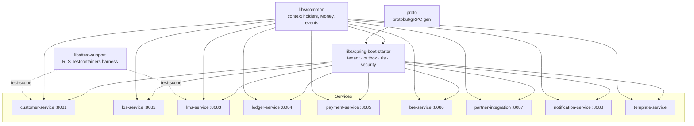
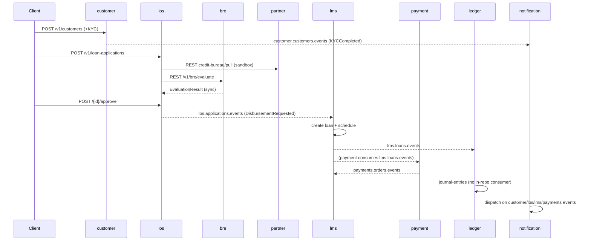
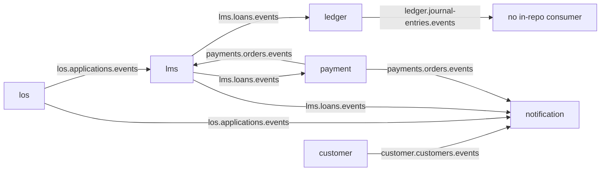

# PLATFORM_AUDIT.md — Originex Source-Verified Architecture Audit

**Date:** 2026-07-14
**Branch:** `worktree-deep-sleeping-ripple` @ `f09fb0e` (auth commits `8a67ba6`…`611f1f0` local/unpushed; RLS Phase 0 `8abbddd`…`0874cd9` on `origin/worktree-deep-sleeping-ripple`; `origin/main` @ `146fd94`).
**Method:** Read directly from source — `pom.xml` (root + modules), `libs/`, all 9 services, Flyway SQL, `application.yml`, `dev/`, `docs/architecture/`, `infra/kafka/topics.yaml`, `dev/init-scripts`. Every claim is cited. Anything not confirmable from the tree is marked **[UNVERIFIED]**.

---

## Executive summary

Originex is a **13-module Maven reactor** (4 foundation modules + 9 Spring Boot 3.4.1 / Java 21 services) implementing a multi-tenant Lending-as-a-Service platform in hexagonal style. The **domain and wiring are substantially built** (REST + transactional-outbox Kafka + Flyway per service), but the platform is **not production-operable**:

- **Authentication is not in any request path** — the `oauth2-resource-server` dependency is optional and declared only in the starter, so the security auto-config backs off in every service. Tenant identity comes from an **unauthenticated `X-Tenant-Id` header**.
- **Authorization is a facade** — RBAC role/scope machinery exists but **zero `@PreAuthorize`** annotations exist in services.
- **RLS is complete but inert** — policies + runtime wiring are done and gated off; every service still connects as the `originex` superuser.
- **External integrations are sandbox-only** — 15 outbound adapters throw `UnsupportedOperationException` in LIVE mode.
- **No Kafka DLQ/error-handler wiring in code** — `.dlq` topics are declared in infra but nothing routes to them.

| Dimension | Completion | One-line reason |
|---|---|---|
| Business logic | ~55% | Core lending flows wired end-to-end (sandbox); collections/settlement/prepayment absent |
| REST APIs | ~70% | 39 endpoints across 8 services, validated; a few unwired paths |
| Kafka integration | ~65% | Outbox+inbox solid; no DLQ/error-handler; 3 domains don't publish |
| Database | ~85% | Schemas, 57 indexes, RLS policies, ledger partitions; no soft-deletes |
| RLS | ~90% | Built + tested + dark; enabled on 0 services |
| Authentication | ~50% | Built in starter; on no service classpath; no IdP |
| Authorization | ~25% | RBAC core only; no `@PreAuthorize`/ownership/S2S |
| Testing | ~55% | Strong RLS harness; thin per-service; partner=0 tests |
| Documentation | ~65% | Design docs good; `RLS_DESIGN.md` banner stale |
| DevOps readiness | ~40% [partly UNVERIFIED] | Helm/Terraform/topics exist; no observed deploy/boot |
| **Production readiness** | **~35%** | No auth, RLS off, sandbox integrations, no full-stack boot observed |

---

## Architecture

### Module dependency graph

**Verified facts:**
- **Build system:** Maven multi-module; Java 21; Spring Boot 3.4.1; Spring Cloud 2024.0.0; Kafka 3.7.2; Confluent 7.7.1; Flyway 10.22.0; Resilience4j 2.2.0; Testcontainers 1.20.4; ArchUnit 1.3.0; MapStruct 1.6.3; Jib 3.4.4; Spotless; OpenTelemetry 1.44.1 (root `pom.xml` properties).
- **Service boundaries:** no service depends on another service's JAR; cross-service coupling is **REST** (sync) or **Kafka via transactional outbox/inbox** (async). Confirmed by module graph + adapter packages.
- **Hexagonal layering** (`domain/`, `application/port/{in,out}`, `application/service`, `adapter/{in,out}/{rest,kafka,persistence}`) applied uniformly; **ArchUnit enforces it only in `template-service`** (`HexagonalArchitectureTest`).
- **proto module:** generated protobuf present; **service-code usage [UNVERIFIED]** this pass (prior audits found zero references; payloads are `byte[]`+headers, not protobuf).

---

## Service inventory

| Service | Port | Purpose | REST | Producers | Consumers | Schedulers | Entities/Repos | Migrations | Status | Key gaps / debt |
|---|---|---|---|---|---|---|---|---|---|---|
| customer | 8081 | Identity, KYC, bank accounts | 8 | ✅ outbox | — | — | 4/1 | V1–V3 | 🟡 wired | PAN encryption stub; live KYC |
| los | 8082 | Application intake, offers, decisioning | 8 | ✅ outbox | — | — | 3/1 | V1–V2 | 🟡 wired | some offer paths; hard `DELETE` |
| lms | 8083 | Loan lifecycle, schedule, accrual, DPD | 4 | ✅ outbox | ✅ 2 | ✅ 2 | 3/1 | V1–V4 | 🟡 wired | redundant in-consumer `set` |
| ledger | 8084 | Double-entry event-sourced ledger | 4 | ✅ outbox | ✅ 1 | — | 3/2 | V1–V5 | 🟡 wired | events consumed by **no in-repo service** |
| payment | 8085 | Disbursement + NACH collection | 6 | ✅ outbox | ✅ 1 | ✅ 1 | 2/2 | V1–V3 | 🟡 wired | sandbox rails |
| bre | 8086 | Rules engine / auto-decisioning | 1 | ❌ none | — | — | 2/2 | V1–V2 | 🟡 wired | no event publish; 1 test |
| partner-integration | 8087 | Bureau/Aadhaar/PAN/bank | 4 | ❌ none | — | — | 1/1 | V1–V2 | 🟡 wired | **0 tests**; sandbox vendors |
| notification | 8088 | SMS/Email/WhatsApp/Push | 0 | ❌ none | ✅ 1 | ✅ 1 | 3/2 | V1–V2 | 🟡 wired | sandbox channels; `enforce=false` |
| template | — | Scaffold for new services | 4 | ✅ sample | — | — | 1/1 | V1–V2 | ⚙ reference | holds the only ArchUnit test |

Entity/repo counts from `@Entity` / repository-interface greps. Note customer/lms/los show 1 repository interface each despite multiple aggregates — **[UNVERIFIED whether additional repos are non-annotated]**.

---

## Business flows (end-to-end)

Legend: ✅ wired (sandbox ok) · 🟡 partial · 🔴 missing.

| Flow | Services | Status | APIs / Events | DB writes | Failure paths / missing |
|---|---|---|---|---|---|
| Customer onboarding | customer(+partner) | 🟡 | `POST /v1/customers`, `/kyc`, `/kyc/aadhaar-ekyc`; emits `customer.customers.events` | customers, kyc_records, bank_accounts, outbox | Live Aadhaar/PAN/bank stubbed; **PAN encryption stub**; no DLQ |
| LOS application | los(+customer) | 🟡 | `POST /v1/loan-applications`, `/documents` | loan_applications, application_documents, outbox | offer edge paths |
| LOS→BRE | los→bre (sync REST) | 🟡 | `POST /{id}/credit-check` → `POST /v1/bre/evaluate` | bre_rule_sets, bre_rules (read) | BRE has no async publish |
| BRE→LOS | bre→los | 🟡 | sync `EvaluationResult` return | loan_applications (decision) | — |
| LOS approval | los | 🟡 | `POST /{id}/approve` / `/reject` → `los.applications.events` | loan_offers, outbox | — |
| Disbursement | los→lms→payment | 🟡 | `los.applications.events`→`DisbursementRequestedConsumer`; `payment /v1/payments/disbursements` | loans, disbursements, payment_orders | sandbox rails; no DLQ |
| LMS loan creation | lms | ✅ | consumer of los events; builds schedule | loans, installments, inbox, outbox | — |
| Ledger posting | ledger | 🟡 | `LmsEventConsumer`←`lms.loans.events`; `POST /journal-entries` | journal_entries, postings, account_snapshots, ledger_events | **journal-entries events consumed by nobody in-repo** |
| Payment initiation | payment | 🟡 | `POST /disbursements`, `/mandates/{id}/collect` | payment_orders, nach_mandates, outbox | sandbox |
| Payment success/failure | payment→lms | 🟡 | `payments.orders.events`→lms `PaymentEventConsumer`; `/callbacks`,`/inbound` | payment_orders | failure/callback logic partial [UNVERIFIED depth] |
| Repayment | lms(→payment/ledger) | 🟡 | `POST /v1/loans/{id}/repayments` | installments, loans | prepayment 🔴; waterfall partial |
| Interest accrual | lms | ✅ | `@Scheduled` cron 00:30 IST, `runAsSystem` → `InterestAccrualProcessor` (outbox) | loans, last_accrual_date, outbox | — |
| DPD aging | lms | 🟡 | `@Scheduled` cron 01:00 IST, `runAsSystem` → `DpdAgingProcessor` | loans (DPD) | — |
| NPA | lms | 🟡 | part of DPD aging (asset classification) | loans | classification partial (per matrix) |
| Notifications | notification | 🟡 | consumer of customer/los/lms/payments events; retry 10 min | notification_requests, channel_dispatches | sandbox channels |
| **Reports** | — | 🔴 | none | — | **No reporting/analytics service exists** |

**Transaction boundaries:** HTTP handlers and Kafka consumers are `@Transactional`; consumers currently set tenant context **inside** the tx (4 consumers) — correct today, but the RLS `TenantRecordInterceptor` hoists it before the tx once `rls.enabled=true`. Outbox write is in the same tx as the domain change (transactional outbox); `OutboxPoller` publishes post-commit (at-least-once) with inbox dedup on the consumer side.

---

## API inventory

All paths under `/v1`. **Authentication: none enforced today** (security auto-config off on every service); tenant resolved from `X-Tenant-Id` via `TenantResolutionFilter` and read in controllers through `TenantContextHolder.requireTenantId()`. **Validation:** Jakarta Bean Validation (`@Valid @RequestBody`) present in all controllers; request/response DTOs are **records nested in the use-case port interfaces** (e.g. `CustomerUseCase.RegisterRequest` → `CustomerResponse.from(...)`). Exhaustive per-field DTO schemas **[UNVERIFIED — summarized by pattern]**.

| Method | Path | Service | Controller | Downstream |
|---|---|---|---|---|
| POST | `/v1/customers` | customer | CustomerController | CustomerUseCase → outbox |
| GET | `/v1/customers/{id}` | customer | CustomerController | CustomerUseCase |
| GET | `/v1/customers/{id}/bank-accounts/primary` | customer | CustomerController | CustomerUseCase |
| PUT | `/v1/customers/{id}` | customer | CustomerController | CustomerUseCase |
| POST | `/v1/customers/{id}/kyc` | customer | CustomerController | CustomerUseCase (→partner) |
| POST | `/v1/customers/{id}/kyc/{kycId}/complete` | customer | CustomerController | CustomerUseCase → outbox |
| POST | `/v1/customers/{id}/kyc/aadhaar-ekyc` | customer | CustomerController | partner (sandbox) |
| POST | `/v1/customers/{id}/bank-accounts` | customer | CustomerController | partner (penny-drop, sandbox) |
| POST | `/v1/loan-applications` | los | LoanApplicationController | LOS use case |
| GET | `/v1/loan-applications/{id}` | los | LoanApplicationController | LOS |
| POST | `/v1/loan-applications/{id}/documents` | los | LoanApplicationController | LOS |
| POST | `/v1/loan-applications/{id}/credit-check` | los | LoanApplicationController | partner + bre (REST) |
| POST | `/v1/loan-applications/{id}/approve` | los | LoanApplicationController | outbox → lms |
| POST | `/v1/loan-applications/{id}/reject` | los | LoanApplicationController | LOS |
| POST | `/v1/loan-applications/{id}/offer/accept` | los | LoanApplicationController | LOS |
| DELETE | `/v1/loan-applications/{id}` | los | LoanApplicationController | LOS (**hard delete**) |
| POST | `/v1/bre/evaluate` | bre | BREController | BRE rules |
| GET | `/v1/loans/{id}` | lms | LoanController | LMS |
| GET | `/v1/loans/{id}/repayment-schedule` | lms | LoanController | LMS |
| POST | `/v1/loans/{id}/repayments` | lms | LoanController | LMS → outbox |
| POST | `/v1/loans/{id}/foreclosure-quote` | lms | LoanController | LMS |
| POST | `/v1/ledger/accounts` | ledger | LedgerController | Ledger |
| GET | `/v1/ledger/accounts/{id}` | ledger | LedgerController | Ledger |
| POST | `/v1/ledger/journal-entries` | ledger | LedgerController | Ledger → outbox |
| POST | `/v1/ledger/journal-entries/{id}/reverse` | ledger | LedgerController | Ledger |
| POST | `/v1/payments/disbursements` | payment | PaymentController | rail (sandbox) → outbox |
| GET | `/v1/payments/{id}` | payment | PaymentController | Payment |
| POST | `/v1/payments/inbound` | payment | PaymentController | Payment |
| POST | `/v1/payments/callbacks` | payment | PaymentController | Payment |
| POST | `/v1/payments/mandates` | payment | PaymentController | NACH (sandbox) |
| POST | `/v1/payments/mandates/{id}/collect` | payment | PaymentController | NACH (sandbox) |
| POST | `/v1/partner/credit-bureau/pull` | partner | PartnerIntegrationController | bureau (sandbox stub) |
| POST | `/v1/partner/aadhaar/verify` | partner | PartnerIntegrationController | Aadhaar (sandbox) |
| POST | `/v1/partner/pan/verify` | partner | PartnerIntegrationController | PAN (sandbox) |
| POST | `/v1/partner/bank-account/verify` | partner | PartnerIntegrationController | bank (sandbox) |
| POST/GET/PUT/DELETE | `/v1/samples...` (4) | template | SampleController | scaffold |

**Total: 39 endpoints** (35 business + 4 scaffold). notification exposes no REST.

---

## Kafka topology & inventory

| Producer svc | Topic | Consumer svc | Consumer class | Retry | DLQ | Idempotency | Ordering |
|---|---|---|---|---|---|---|---|
| customer | `originex.customer.customers.events` | notification | DomainEventNotificationConsumer | none in code | none in code | inbox dedup | per-partition (key) [UNVERIFIED key] |
| los | `originex.los.applications.events` | lms | DisbursementRequestedConsumer | none | none | inbox | per-partition |
| lms | `originex.lms.loans.events` | ledger, payment, notification | LmsEventConsumer / LmsPaymentEventConsumer / … | none | `.dlq` topic declared, **not wired** | inbox | per-partition |
| payment | `originex.payments.orders.events` | lms, notification | PaymentEventConsumer / … | none | `.dlq` declared, not wired | inbox | per-partition |
| ledger | `originex.ledger.journal-entries.events` | — | — | — | — | — | — |
| template | (sample) | — | KafkaEventPublisherAdapter | — | — | — | — |

**Verified:** producers use `OutboxPublisher` + `OutboxPoller.resolveTopicFromEventType()`; no direct `KafkaTemplate` outside the starter. Consumers are `@Transactional` with **inbox-based idempotency** (`InboxEventJpaEntity`/`InboxEventRepository`). **No `RetryableTopic`/`DefaultErrorHandler`/`DeadLetterPublishingRecoverer`/`BackOff` anywhere** — DLQ topics (`lms.loans.events.dlq`, `payments.orders.events.dlq`) exist in `infra/kafka/topics.yaml` but nothing publishes to them. `bre`, `partner`, `notification` **do not publish** (topics reserved). Kafka transport is **plaintext** (no SSL/SASL config found).

---

## Database audit

| Service | Entities | Repos | RLS tables (hardened) | Notable |
|---|---|---|---|---|
| customer | 4 | 1 | customers, kyc_records, bank_accounts, addresses | outbox non-RLS |
| los | 3 | 1 | loan_applications, loan_offers, application_documents | — |
| lms | 3 | 1 | loans, installments, disbursements, loan_charges | gap tables closed (V3) |
| ledger | 3 | 2 | account_snapshots, journal_entries, postings, ledger_events | **monthly partitions** (`ledger_events_y2026m07/m08`) |
| payment | 2 | 2 | payment_orders, nach_mandates | — |
| bre | 2 | 2 | bre_rule_sets, bre_rules | — |
| partner | 1 | 1 | integration_requests | — |
| notification | 3 | 2 | notification_requests, notification_templates | channel_dispatches, idempotency table |
| template | 1 | 1 | samples | — |

**Cross-cutting (verified):**
- **RLS:** every service has a `V*__harden_rls_policies.sql` with fail-closed `current_setting('app.tenant_id', true)` **+ `WITH CHECK`**; enabled/forced on all tenant tables. **Inert** — services connect as `originex` superuser.
- **Indexes:** **57** `CREATE [UNIQUE] INDEX` statements across migrations.
- **Constraints:** FK/CHECK/UNIQUE present across schemas (not exhaustively counted).
- **Partitions:** only ledger (`ledger_events` by month).
- **Audit fields:** `created_at` present in ~10 migration files (most schemas); `updated_at` usage [UNVERIFIED exhaustively].
- **Soft deletes:** **none** (`deleted_at`/`is_deleted` absent) — los `DELETE` is a hard delete.
- **Migrations:** additive `V__` per service; DDL/seed run as `originex` today, re-pointed to `originex_owner` under the `rls` profile.

---

## Security audit

| Control | Implemented | Partial | Design-only | Missing |
|---|---|---|---|---|
| Authentication (JWT resource server) | | ✅ built in starter (RS256 allowlist, issuer+audience validators, ENFORCED/PERMISSIVE) | | not on any service classpath; **no IdP** (`dev/keycloak` absent) |
| Authorization (RBAC) | | ✅ core (roles/scopes/method-security) | | **no `@PreAuthorize` in services** |
| Ownership (subject-scope) | | | ✅ designed (AUTH_DESIGN §4) | no `@access`/`isSelf`/`ownsLoan` code |
| RLS | ✅ policies+runtime (dark) | enablement | | not enabled anywhere |
| Tenant handling | ✅ header→context; claim path built | | | header trust not eliminated |
| Service-to-service auth | | | ✅ designed (private_key_jwt/mTLS) | no code; inter-svc REST propagates `X-Tenant-Id` |
| Kafka security | | | | **plaintext** — no SSL/SASL |
| Secrets | | | | dev passwords hardcoded (`originex_local`) in every `application.yml`; prod override [UNVERIFIED] |
| Exposed endpoints / actuator | ✅ restrained | | | actuator exposure = `health,info,prometheus,metrics` + liveness/readiness groups (no env/heapdump) |
| CORS | | | | **no CORS config** anywhere |
| Validation | ✅ Bean Validation on all controllers | | | — |
| Fail-closed / default-off | ✅ RLS NULL→zero rows; auth+RLS default-off | | | — |

---

## Testing audit

| Type | Present | Evidence |
|---|---|---|
| Unit | ✅ | `libs/common` (Money, SubjectContext), starter security+rls (**47 green**, verified `mvn -pl libs/spring-boot-starter -am test`) |
| Integration (Testcontainers) | ✅ | `RlsPostgresSupport`; `LoanLifecycleIntegrationTest` (lms); RLS ITs |
| RLS / security ITs | ✅ (partial) | 3 `@Tag("rls")`: customer semantics, customer HTTP, lms consumer+scheduler |
| Architecture (ArchUnit) | 🟡 | only `template-service/HexagonalArchitectureTest`; **no auth deny-by-default rule** |
| End-to-end (full stack) | 🔴 | none observed; documented local Docker blocker |
| Contract tests | 🔴 | none found (no Spring Cloud Contract / Pact) |
| Performance tests | 🔴 | none found |
| Per-service coverage | 🟡 | bre=1, customer=3, ledger=3, lms=7, los=2, notification=2, payment=3, template=1, **partner=0** |

**Missing coverage:** authorization (nothing to test — no annotations), ownership, S2S, real-IdP, DLQ/error paths, 6 services lack RLS ITs, contract + performance suites entirely.

---

## Documentation audit (`dev/`)

| Doc | Verdict | Note |
|---|---|---|
| `AUTH_DESIGN.md` | ✅ accurate | Matches built auth through RBAC core; remainder explicitly future |
| `RLS_DESIGN.md` | ⚠ **contradicted by implementation** | Header says *"Design only — no application code written"*; false (all Phase 0 code + policies exist) |
| `RLS_ENABLEMENT.md` | ✅ accurate | Env vars/profile match `application-rls.yml` + init-scripts |
| `PROJECT_STATUS.md` | ✅ current | Added this session; canonical status |
| `PHASE0_VERIFICATION.md` | 🟡 partially outdated | Predates RLS-runtime commits |
| `E2E_VERIFICATION_GUIDE.md` | 🟡 partially outdated | Predates auth; won't cover secured path |
| `docker-compose.yml` | 🟡 | No Keycloak/IdP though AUTH_DESIGN §11 calls for one |
| `init-databases.sql` | ✅ accurate | owner/system/app roles + grants match design |
| Top-level `CURRENT_STATE.md`/`CLAUDE_HANDOVER.md`/`CLAUDE_ANALYSIS.md`/`BUSINESS_CAPABILITY_MATRIX.md` | ⚠ obsolete on RLS/auth | Dated 9-Jul; assert "RLS inert / zero set_config / Auth none" — now false; superseded by `PROJECT_STATUS.md` |

---

## Completion table (with reasoning)

| Area | % | Reasoning (source-based) |
|---|---|---|
| Business logic | 55 | Core onboarding→application→disbursement→servicing→accrual wired (sandbox); prepayment/collections/settlement/write-off/reporting absent (matrix) |
| REST APIs | 70 | 39 endpoints, validated, hexagonal; some unwired offer/callback depth |
| Kafka integration | 65 | Outbox+inbox robust; **no DLQ/error-handler**; 3 domains non-publishing; ledger events unconsumed |
| Database | 85 | Schemas + 57 indexes + RLS + ledger partitions; no soft-deletes; audit fields partial |
| RLS | 90 | Complete + tested, dark; 0 services enabled |
| Authentication | 50 | Built in starter, unit-tested; no service dep, no IdP, header conflict |
| Authorization | 25 | RBAC core only; no `@PreAuthorize`/ownership/S2S |
| Testing | 55 | Strong RLS harness; no e2e/contract/perf; partner=0 |
| Documentation | 65 | Design docs good; one false banner; stale snapshots |
| DevOps readiness | 40 [partly UNVERIFIED] | Helm chart, Terraform (vpc/eks/rds/redis), Strimzi topics, Jib exist; no observed build image/deploy/boot |
| **Production readiness** | **35** | No auth in path, RLS off, sandbox integrations, no full-stack boot |

---

## Risk matrix

| Risk | Likelihood | Impact | Severity |
|---|---|---|---|
| Unauthenticated `X-Tenant-Id` is the live tenant boundary | Certain (today) | Critical | 🔴 Critical |
| RBAC facade — any caller reaches any op (no `@PreAuthorize`) | Certain once auth on | Critical | 🔴 Critical |
| RLS never proven on a booted service | High | High | 🔴 Critical |
| Legacy filter 400s valid tokened requests (`enforce=true`) | Certain when auth on | High | 🟠 High |
| No Kafka DLQ/error-handler → poison messages block partitions | Medium | High | 🟠 High |
| Sandbox-only integrations (15 adapters throw in LIVE) | Certain | High | 🟠 High |
| Plaintext Kafka, hardcoded dev secrets | High (non-dev) | High | 🟠 High |
| Ledger events consumed by nobody in-repo | Medium | Medium | 🟡 Medium |
| Doc drift misleads operators | Medium | Medium | 🟡 Medium |
| No CORS (if browser clients) | Low [UNVERIFIED clients] | Medium | 🟡 Medium |

---

## Production readiness assessment

- **Can the platform run today?** Locally, individual services boot against Postgres/Kafka with `X-Tenant-Id`; a **full multi-service stack has not been observed to boot** (documented Docker blocker — `CURRENT_STATE.md`). **[UNVERIFIED end-to-end boot].**
- **Can a customer complete a full loan lifecycle?** In principle onboarding→application→approval→disbursement→servicing→accrual is wired and exercised by `LoanLifecycleIntegrationTest` (Testcontainers, lms) — but only with **sandbox** integrations and **no auth**. Not a real production lifecycle.
- **Which services are production-ready?** **None.** All are capped by no-auth + inert-RLS + sandbox integrations.
- **Which flows are incomplete?** Reports (🔴 absent), prepayment/collections/settlement/write-off (🔴), payment failure/callback depth (🟡), ledger downstream consumption (🟡), NPA classification (🟡).
- **Top 10 blockers:** (1) no authentication in request path; (2) no `@PreAuthorize` authorization; (3) RLS unproven on a booted service; (4) legacy filter vs auth 400 conflict; (5) sandbox-only external integrations; (6) no Kafka DLQ/error-handling; (7) plaintext Kafka + hardcoded secrets; (8) no IdP (Keycloak) provisioned; (9) no e2e/contract/perf tests; (10) no reporting/analytics capability.

---

## Prioritized roadmap

| Prio | Item | Effort | Depends on |
|---|---|---|---|
| 🔴 Critical | Gate/retire `TenantResolutionFilter` under `security.enabled`; retire `X-Tenant-Id` | S–M | — |
| 🔴 Critical | Wire `oauth2-resource-server` into services + stand up dev Keycloak (realm export) | M | — |
| 🔴 Critical | Canary-enable RLS on customer-service on a booted service in CI | M | RLS wiring (done) |
| 🔴 Critical | Apply `@PreAuthorize` across services + ArchUnit deny-by-default | L | RBAC core (done) |
| 🟠 High | Kafka error-handler + DLQ routing (wire the declared `.dlq` topics) | M | — |
| 🟠 High | Ownership authorization (`@access`, D2) for CUSTOMER | M | `@PreAuthorize` |
| 🟠 High | Move external integrations from sandbox to live (per vendor) | L | credentials |
| 🟡 Medium | Extend RLS ITs to los/ledger/payment/notification/bre/partner | M | RLS canary |
| 🟡 Medium | Kafka TLS/SASL + externalized secrets | M | infra |
| 🟡 Medium | Fix `RLS_DESIGN.md` banner; retire stale 9-Jul snapshots | S | — |
| 🟡 Medium | Add partner-integration tests (currently 0) | S | — |
| 🟢 Low | S2S auth (private_key_jwt/mTLS) + platform-admin route | L | auth enable |
| 🟢 Low | Reporting/analytics capability; collections/prepayment/settlement | L | product scope |
| 🟢 Low | Remove redundant in-consumer `TenantContextHolder.set` (4) | S | RLS enabled |

---

## Merge readiness (commit groups)

| Group | Commits | Verdict | Why |
|---|---|---|---|
| Domain/business baseline | `146fd94` | Merged | On `origin/main` |
| RLS Phase 0 (roles, tx-mgr, routing, interceptor, schedulers, migrations, profile, ITs, docs) | `8abbddd`…`0874cd9` | **Safe to merge** (needs review) | Fully gated off; tested; pushed to feature branch; only doc-banner fix outstanding |
| Auth foundation→RBAC core | `8a67ba6`…`611f1f0` | **Needs changes before enable / review before merge** | 47 tests green and dark, so mergeable as dark code; **blocked from enablement** by no-oauth-dep, no IdP, legacy-filter conflict; currently local/unpushed |
| Docs: `PROJECT_STATUS.md`, `PLATFORM_AUDIT.md` | `f09fb0e`, this | Safe to merge | Docs only |

No group is experimental; none is safe to **enable** in production.

---

### Verification boundaries
- Full-stack runtime boot, live vendor behavior, non-dev secret/role provisioning, gateway/mesh, observability pipeline, and exhaustive per-endpoint DTO field schemas are **[UNVERIFIED]** from source in this pass.
- `proto` usage by service code **[UNVERIFIED]** (payloads are `byte[]`+headers).
- Completion percentages are reasoned estimates from verified wiring, not measured coverage.
