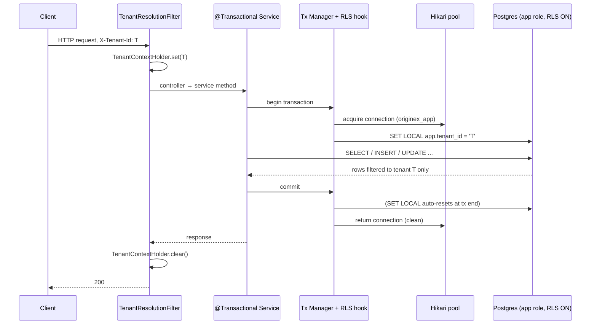

# Design: Row-Level Security (RLS) Runtime Enforcement

**Status:** Design — approved for documentation, not yet implemented.
**Scope:** Activate the already-present PostgreSQL RLS policies so tenant isolation is enforced at the database for every service.
**Owner:** LMS/platform.

---

## 1. Core insight

Every domain table already has `ENABLE ROW LEVEL SECURITY` + `FORCE ROW LEVEL SECURITY` with a policy:

```sql
USING (tenant_id = current_setting('app.tenant_id')::uuid)
```

RLS is **inert today for one reason only**: the application connects as a PostgreSQL **superuser**, and superusers bypass even `FORCE` RLS. Therefore enabling RLS is primarily a **role + per-transaction-session-variable** change, **not** a schema rewrite. This makes the change high-leverage (one shared-library change covers all 9 services) and cleanly reversible (config-only rollback).

---

## 2. Verified audit results (facts, not assumptions)

### 2.1 Runtime PostgreSQL role — **VERIFIED: superuser**
- `dev/docker-compose.yml`: `POSTGRES_USER: originex` → the Postgres image creates this as a **superuser**.
- All 9 services: `spring.datasource.username: originex` (uniform).
- `dev/init-scripts/init-databases.sql`: only `GRANT ALL ... TO originex`; **no `CREATE ROLE`, no non-superuser role exists**.
- Flyway inherits the datasource user (no override) → migrations also run as superuser.
- **Conclusion:** RLS is bypassed purely because of the superuser role. Switching the app to a non-superuser role activates the existing policies.

### 2.2 Transactional-access audit — **two issues found**
- **HTTP path — OK.** `TenantResolutionFilter` (servlet filter) sets `TenantContextHolder` *before* the controller/`@Transactional` service runs, so a transaction-begin hook will see the tenant.
- **Kafka consumers — ORDERING PROBLEM.** Consumers are `@Transactional` at the handler method and set `TenantContextHolder` **inside** that method:
  - `lms DisbursementRequestedConsumer` — tx `@47`, `set` `@74`.
  - `ledger LmsEventConsumer` — tx `@75`, `set` `@95` (writes `account_snapshots`/`journal_entries`/`postings`, all RLS-protected).
  - `lms PaymentEventConsumer`, `payment LmsPaymentEventConsumer` — same shape (their RLS-table writes go through service calls).
  A transaction-begin hook fires **before** the in-method `set()`, so `app.tenant_id` would be unset → fail-closed. **Fix required:** establish tenant context *before* the transaction begins (see §6.2, Kafka `RecordInterceptor`).
- **Cross-tenant scheduled workers over RLS tables** (need the system route, §7):
  - `lms InterestAccrualService.runDailyAccrual` → `findAccruable` over `loans`.
  - `lms DpdAgingService.runDailyAging` → `findDelinquent` over `loans`.
  - `notification NotificationApplicationService.retryFailed` → `findPendingRetries` over `notification_requests`.
  - `payment PaymentApplicationService.retryFailedPayments` → `findPendingRetries` over `payment_orders`.
- **Safe cross-tenant worker:** `OutboxPoller.pollAndPublish` / `cleanupPublishedEvents` touch **`outbox_events` only, which is NOT RLS-protected** → no change needed.

### 2.3 notification-service — **recommendation: participate in RLS**
- Its tables `notification_requests` and `notification_templates` **are** RLS-protected.
- Its consumer (`DomainEventNotificationConsumer`) reads `tenant_id` from the event header and passes it as a **method parameter** — it **never calls `TenantContextHolder.set()`**.
- `tenant.enforce: false` (correct — it has no tenant-bearing HTTP surface; it is event-driven).
- **Recommendation:** notification-service **should** be RLS-subject (its data is tenant-scoped). It needs the same Kafka `RecordInterceptor` fix to set tenant context before its transaction, and its `retryFailed` scheduler must use the system route. It is the service requiring the most consumer-side change because it sets no context today.

### 2.4 RLS coverage gaps found
- **No `WITH CHECK`** on any policy → INSERT/UPDATE currently fall back to the `USING` expression for the write check; write-side enforcement should be made explicit (§8).
- **`disbursements` and `loan_charges` (LMS) have no RLS policy** at all — they must be added.

---

## 3. Which tables are RLS-protected

| Service | RLS-protected tables | Not protected |
|---|---|---|
| customer | customers, kyc_records, bank_accounts | outbox_events |
| los | loan_applications, loan_offers, application_documents | outbox_events |
| lms | loans, installments | **disbursements, loan_charges (GAP)**, outbox_events, inbox_events |
| ledger | account_snapshots, journal_entries, postings | outbox_events, inbox_events |
| bre | bre_rule_sets, bre_rules | — |
| partner | integration_requests | — |
| payment | payment_orders, nach_mandates | outbox_events, inbox_events |
| notification | notification_requests, notification_templates | (own idempotency table) |

`outbox_events` / `inbox_events` are intentionally non-RLS (operational infrastructure) — this is why the outbox poller needs no special handling.

---

## 4. End-to-end request flow (target)



## 5. Scheduled-job flow (target)

```mermaid
sequenceDiagram
    participant J as Scheduler (accrual / DPD / notif-retry / pay-retry)
    participant SC as SystemContextHolder
    participant R as RoutingDataSource
    participant DB as Postgres

    J->>SC: enter system context
    J->>R: eligibility scan (cross-tenant)
    R->>DB: connection as originex_system (BYPASSRLS)
    DB-->>J: rows across ALL tenants
    loop per item (own @Transactional)
        J->>DB: process one item (BYPASSRLS route; writes tenant_id explicitly)
    end
    J->>SC: exit system context
    Note over J,DB: OutboxPoller is exempt — outbox_events is not RLS-protected
```

---

## 6. Where & how `SET LOCAL app.tenant_id` is applied

### 6.1 Transaction-begin hook (HTTP + set-before-tx paths)
- Implemented in **`libs/spring-boot-starter`** as a transaction-manager customization (or an equivalent begin-time synchronization) that, immediately after the transaction acquires its connection, executes `SET LOCAL app.tenant_id = ?` using `TenantContextHolder`.
- **`SET LOCAL`** (transaction-scoped) is mandatory — it auto-resets at commit/rollback so a pooled connection never leaks a tenant value to the next borrower.
- Gated by `originex.rls.enabled` (default `false`) so it can ship dark.
- No-ops on the **system route** (BYPASSRLS ignores policies) and when no tenant context is present on a system-context thread.

### 6.2 Kafka consumers — set tenant context *before* the transaction
The audit (§2.2) shows consumers set context inside the transactional method. Fix by hoisting resolution ahead of the transaction:
- Add a Kafka **`RecordInterceptor`** in the shared starter's listener-container factory that reads the `tenant_id` header and calls `TenantContextHolder.set(...)` **before** the `@Transactional` listener runs, clearing it afterward — the consumer-side analogue of `TenantResolutionFilter`.
- This centralizes tenant resolution, removes the per-consumer manual `set`/`clear`, and **fixes notification-service** (which sets nothing today).
- Consumers keep their `@Transactional` boundary; the hook now sees the tenant at tx-begin.

---

## 7. Connection pooling, transaction boundaries & background workers

### 7.1 Pooling / boundaries
- Hikari reuses connections; `SET LOCAL` reset at transaction end is exactly what keeps this safe.
- **All RLS-table access must be transactional** so the variable is set. `open-in-view: false` is already configured platform-wide (good). The audit found no non-transactional repository access to RLS tables on the HTTP path; scheduled eligibility scans run outside a transaction but on the **system (BYPASSRLS)** route, so they are unaffected.
- Virtual threads on; `TenantContextHolder`/`SystemContextHolder` are per-(virtual-)thread `ThreadLocal`s with set-use-clear — safe.

### 7.2 RoutingDataSource (preferred — preserves repository transparency)
A Spring `AbstractRoutingDataSource` with two targets, keyed by a `SystemContextHolder` flag:

| Route | Role | Used by |
|---|---|---|
| `app` (default) | `originex_app` (NOSUPERUSER, **NOBYPASSRLS**) | HTTP + Kafka-consumer flows |
| `system` | `originex_system` (NOSUPERUSER, **BYPASSRLS**) | accrual/DPD eligibility scans, notification-retry, payment-retry, Flyway seeds |

- Repositories/EntityManager are unchanged — routing is transparent, so transaction management is not complicated (single `EntityManagerFactory`, single tx manager).
- The routing key is read when the transaction acquires its connection, so schedulers set system context **outside** the `@Transactional` boundary (they already call processors from a non-transactional loop → holds).
- `OutboxPoller` may stay on the `app` route (its tables are non-RLS); it may optionally run in system context for consistency.

**Rejected alternative:** two explicitly-wired DataSources/EntityManagers — forces separate repository wiring per route and complicates transactions. Routing keeps it transparent.

---

## 8. PostgreSQL role model (keep three roles)

| Role | Attributes | Purpose |
|---|---|---|
| `originex_owner` | owns schema objects; DDL rights | Flyway **DDL** (table/index creation) |
| `originex_system` | `NOSUPERUSER BYPASSRLS` | Flyway **seed DML**; system-route background jobs |
| `originex_app` | `NOSUPERUSER NOBYPASSRLS`; `GRANT SELECT/INSERT/UPDATE/DELETE` on all tables | runtime request/consumer DML (RLS-subject) |

Separate roles are retained (least privilege): the app role can never bypass RLS, while migrations/system jobs can. Owner and system may be merged only if operationally necessary; the audit gives no security reason to reduce below three.

**Write-side enforcement (`WITH CHECK`) — recommend shipping WITH the initial enablement.** Add `WITH CHECK (tenant_id = current_setting('app.tenant_id', true)::uuid)` to every policy so the app role cannot *write* another tenant's row, not just read. Read-only isolation without write enforcement is a partial control; the addition is cheap and additive, so it should land in the same migration set as enablement, not as a fast-follow.

---

## 9. Migration strategy

All schema changes are **additive** new `V__` migrations (no historical migration edited). Run under the `originex_system`/owner roles.

1. **Add missing policies:** `disbursements`, `loan_charges` (LMS) — `ENABLE`+`FORCE` + tenant policy.
2. **Add `WITH CHECK`** to every existing policy (write-side enforcement).
3. **Switch reads to fail-closed:** `current_setting('app.tenant_id', true)` (the `true` = missing_ok → unset yields `NULL` → zero rows instead of a hard error).
4. **Role creation** in `dev/init-scripts` + CI + deploy provisioning (owner/system/app), with grants.
5. **Flyway** configured to run as `originex_system` (BYPASSRLS) so seed INSERTs into RLS tables succeed.

### 9.1 Phased, per-service rollout
- **Phase 0 — ship dark (no behavior change).** Land roles, RoutingDataSource, RLS tx-hook, Kafka `RecordInterceptor`, and policy migrations with `originex.rls.enabled=false`; app still connects as a bypass/superuser role. Fully deployed but inert.
- **Phase 1 — dev/CI enablement.** App datasource → `originex_app`; system route → `originex_system`; `rls.enabled=true`. Run the isolation + system-job test suites.
- **Phase 2 — staging, then production, one service at a time** in dependency order: `customer → los → lms → ledger → payment → bre → partner → notification`. Each service is independently switchable (per-service datasource role + flag), so a problem in one does not block others.

### 9.2 Rollback plan
RLS enforcement is gated by **role + flag**, not schema:
- **Immediate:** set `originex.rls.enabled=false` **and/or** point the service's datasource back to a BYPASSRLS/superuser role → RLS instantly inert for that service. **No DDL reversal** — policies are harmless when the connecting role bypasses.
- **Per-service granularity:** roll back only the offending service; others stay enforced.
- The additive policy/`WITH CHECK` migrations can remain in place during rollback (inert under a bypass role); they need not be reverted.
- Full teardown (only if ever required): drop the added policies via a new additive migration; never edit history.

---

## 10. Fail-closed: operational impact & troubleshooting

**Design choice (kept):** unset `app.tenant_id` → policy sees `NULL` → **zero rows** (reads) / rejected writes — never all-tenant data. Safe by default; the failure mode is "missing data," not "leaked data."

**Operational impact:** a code path that reaches an RLS table without tenant context (new endpoint missing the filter, a consumer bypassing the interceptor, a job not marked system-context, or non-transactional access) will **silently return empty results or fail to persist**, rather than erroring loudly. Symptoms: "record not found" / empty lists / "row violates row-level security policy" on writes.

**Troubleshooting guidance:**
1. **Confirm the connecting role:** `SELECT current_user;` — must be `originex_app` for request flows, `originex_system` for jobs/Flyway.
2. **Confirm the session variable inside a transaction:** `SELECT current_setting('app.tenant_id', true);` — `NULL`/empty means the tx-begin hook did not fire (context not set before the transaction).
3. **Check ordering:** verify `TenantContextHolder` is set **before** the `@Transactional` boundary (HTTP filter, Kafka `RecordInterceptor`) — the #1 cause of empty results after enablement.
4. **Check route:** a cross-tenant job returning nothing usually means it is **not** in system context (running on the `app` route). Confirm `SystemContextHolder` is set around the job.
5. **Writes rejected** ("new row violates row-level security policy for table …") means the row's `tenant_id` ≠ `app.tenant_id` (a `WITH CHECK` violation) — the code is writing a tenant it isn't scoped to.
6. **Enable RLS debug logging** (temporary): log `current_user` + `current_setting('app.tenant_id', true)` at transaction start behind a debug flag.
7. **Fast bisect:** flip `originex.rls.enabled=false` for the affected service; if the symptom disappears, it is a tenant-context/route gap, not a data problem.

---

## 11. Affected services & shared libraries

- **`libs/spring-boot-starter` (primary):** RLS transaction-begin hook; `RoutingDataSource` + `SystemContextHolder`; Kafka `RecordInterceptor`; autoconfig wiring; `OriginexProperties` (`rls.enabled`, system-datasource props).
- **`libs/common`:** `SystemContextHolder` (companion to `TenantContextHolder`).
- **Per service (small):** datasource/Flyway role config in `application.yml`; the four cross-tenant schedulers (accrual, DPD, notification-retry, payment-retry) wrap runs in system context; new policy migrations (LMS `disbursements`/`loan_charges`; `WITH CHECK` + `missing_ok` across all services).
- **`dev/init-scripts` + CI + deploy manifests:** create `originex_owner` / `originex_system` / `originex_app` and grants.
- **Kafka consumers** (customer/los/lms/ledger/payment/notification): remove manual in-method `set/clear` once the `RecordInterceptor` centralizes it.

---

## 12. Test plan

- **Multi-tenant isolation (Testcontainers):** seed tenant A + B; as `originex_app` with `app.tenant_id=A`, assert reads/updates/deletes see only A; assert a write carrying B's `tenant_id` is rejected (`WITH CHECK`). Cover one table per category.
- **Fail-closed:** a transaction with no `app.tenant_id` returns zero rows (not error, not all rows).
- **Connection-reuse safety:** run A-tx then B-tx on the same pooled connection; assert no `app.tenant_id` bleed.
- **Kafka consumer ordering:** publish a tenant-A event; assert the consumer's RLS-table writes succeed (proves `RecordInterceptor` sets context before the tx).
- **System-job scenarios:** accrual/DPD/notification-retry/payment-retry under system context see rows across A+B; `OutboxPoller` publishes A+B events; Flyway seeds apply under `originex_system`.
- **End-to-end:** run `LoanLifecycleIntegrationTest` as `originex_app` with `rls.enabled=true` — the full lifecycle must pass, finally exercising the enforced path in CI.
- **Regression:** full suite green with `rls.enabled=true`.
- (All Testcontainers-based → executed in CI given the local Docker-v29 blocker.)

---

## 13. Risks & alternatives

**Risks**
- **Kafka consumer context ordering** (audit-confirmed) — the biggest correctness risk; mitigated by the `RecordInterceptor` prerequisite.
- **A missed tenant-context path** → fail-closed empty results (safe but user-visible); mitigated by fail-closed choice + tests + troubleshooting runbook.
- **Flyway seeds** require BYPASSRLS — mitigated by running migrations as `originex_system`.
- **RoutingDataSource key timing** — schedulers must set system context outside the tx boundary (already true structurally).
- **Per-service secret/role sprawl** — three roles × environments; ops overhead.

**Alternatives considered & rejected**
- **App-layer `WHERE tenant_id=…` only:** one missed clause leaks data; RLS is the backstop. Rejected as the sole control.
- **Per-tenant iteration for background jobs (no system role):** needs a cross-tenant tenant registry that does not exist (DB-per-service) → circular. Rejected.
- **`SET` (session) instead of `SET LOCAL`:** leaks across pooled borrowers. Rejected.
- **DataSource wrapper that SETs on `getConnection()`:** fights pooling/reset semantics. Rejected for the tx-begin hook.
- **Two explicit DataSources instead of routing:** breaks repository transparency, complicates transactions. Rejected per the routing-preferred directive.

---

## 14. Assumptions — resolved by audit

| # | Assumption | Result |
|---|---|---|
| 1 | App connects as a superuser | **Confirmed** — `originex` = docker `POSTGRES_USER` (superuser); no other roles exist |
| 2 | All DB access is transactional | **HTTP yes; Kafka consumers set context inside the tx (must hoist); retry schedulers are cross-tenant** — see §2.2 |
| 3 | Routing vs explicit DataSources | **Routing** — preserves repository transparency, single tx manager |
| 4 | Unset-tenant behavior | **Fail-closed** kept; operational impact + runbook in §10 |
| 5 | notification-service in RLS | **Yes, with the consumer-context fix**; retry via system route — §2.3 |
| 6 | Role model | **Three roles** (owner/system/app) retained — least privilege |
| 7 | Rollout | **Phased, per-service** — §9.1 |
| 8 | `WITH CHECK` timing | **Ship with initial enablement** (not deferred) — §8 |

Remaining to confirm at build time: exact tx-begin hook mechanism (custom tx manager vs synchronization) and whether `originex_owner` and `originex_system` are merged.

---

## 15. Prerequisites checklist before Phase 0

- [ ] **Kafka `RecordInterceptor`** (tenant-context-before-tx) designed and reviewed — blocks correct consumer behavior under RLS.
- [ ] **Audit sign-off** that no non-transactional access hits RLS tables on the request path (HTTP confirmed; re-check any new endpoints).
- [ ] **Role provisioning** scripted for dev (`dev/init-scripts`), CI, and deploy (owner/system/app + grants + per-role secrets).
- [ ] **Flyway** re-pointed to `originex_system` for seed migrations; confirm every seed migration writes RLS tables only under that role.
- [ ] **RoutingDataSource + `SystemContextHolder`** design reviewed; confirm schedulers set system context outside their `@Transactional` boundary.
- [ ] **`originex.rls.enabled` flag** wired (default `false`) with per-service override.
- [ ] **Policy migrations drafted:** `disbursements`/`loan_charges` policies, `WITH CHECK` on all policies, `current_setting('app.tenant_id', true)` fail-closed switch.
- [ ] **Testcontainers harness** updated to create the three roles and connect as `originex_app` (app) / `originex_system` (jobs+Flyway).
- [ ] **Troubleshooting runbook** (§10) published for on-call.
- [ ] **Rollback verified** in dev: flip flag/role → RLS inert, no data change.

---

*Design only. No application code has been written. Implementation begins with Phase 0 (ship dark) after the prerequisites above are met.*
